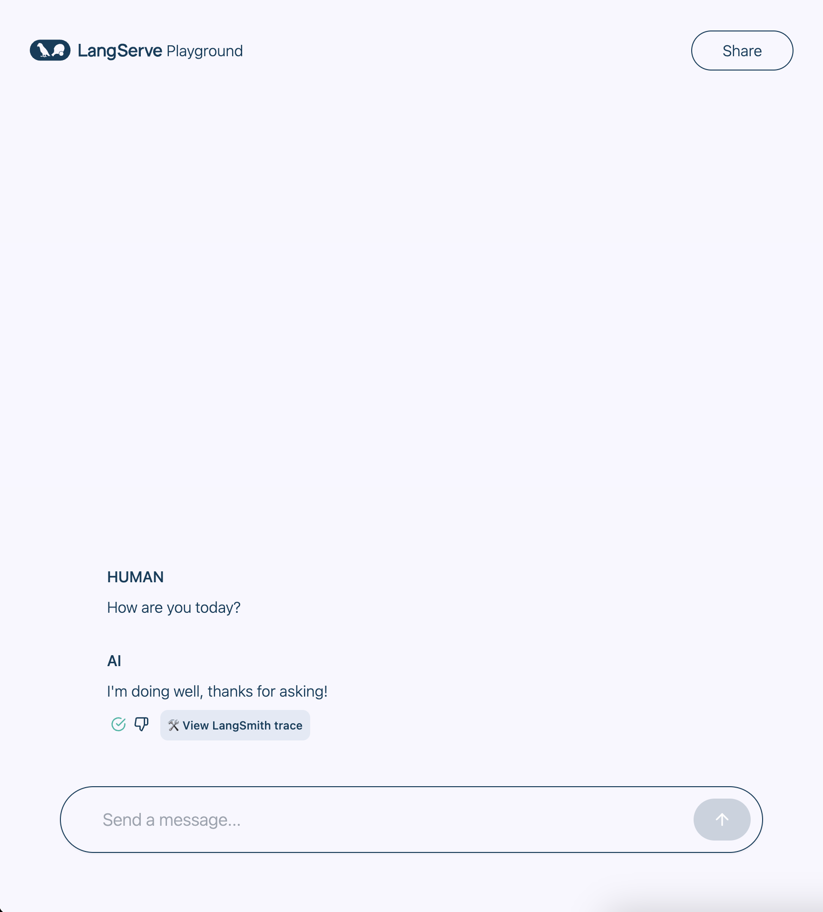

# 🦜️🏓 LangServe

[](https://github.com/langchain-ai/langserve/releases)
[](https://pepy.tech/project/langserve)
[](https://github.com/langchain-ai/langserve/issues)
[](https://discord.com/channels/1038097195422978059/1170024642245832774)

🚩 We will be releasing a hosted version of LangServe for one-click deployments of
LangChain applications. [Sign up here](https://forms.gle/KC13Nzn76UeLaghK7)
to get on the waitlist.

## Overview

[LangServe](https://github.com/langchain-ai/langserve) helps developers
deploy `LangChain` [runnables and chains](https://python.langchain.com/docs/expression_language/)
as a REST API.

This library is integrated with [FastAPI](https://fastapi.tiangolo.com/) and
uses [pydantic](https://docs.pydantic.dev/latest/) for data validation.

In addition, it provides a client that can be used to call into runnables deployed on a
server.
A JavaScript client is available
in [LangChain.js](https://js.langchain.com/docs/ecosystem/langserve).

## Features

- Input and Output schemas automatically inferred from your LangChain object, and
  enforced on every API call, with rich error messages
- API docs page with JSONSchema and Swagger (insert example link)
- Efficient `/invoke`, `/batch` and `/stream` endpoints with support for many
  concurrent requests on a single server
- `/stream_log` endpoint for streaming all (or some) intermediate steps from your
  chain/agent
- **new** as of 0.0.40, supports `/stream_events` to make it easier to stream without needing to parse the output of `/stream_log`.
- Playground page at `/playground/` with streaming output and intermediate steps
- Built-in (optional) tracing to [LangSmith](https://www.langchain.com/langsmith), just
  add your API key (see [Instructions](https://docs.smith.langchain.com/))
- All built with battle-tested open-source Python libraries like FastAPI, Pydantic,
  uvloop and asyncio.
- Use the client SDK to call a LangServe server as if it was a Runnable running
  locally (or call the HTTP API directly)
- [LangServe Hub](https://github.com/langchain-ai/langchain/blob/master/templates/README.md)

## Limitations

- Client callbacks are not yet supported for events that originate on the server
- OpenAPI docs will not be generated when using Pydantic V2. Fast API does not
  support [mixing pydantic v1 and v2 namespaces](https://github.com/tiangolo/fastapi/issues/10360).
  See section below for more details.

## Hosted LangServe

We will be releasing a hosted version of LangServe for one-click deployments of
LangChain
applications. [Sign up here](https://forms.gle/KC13Nzn76UeLaghK7)
to get on the waitlist.

## Security

- Vulnerability in Versions 0.0.13 - 0.0.15 -- playground endpoint allows accessing
  arbitrary files on
  server. [Resolved in 0.0.16](https://github.com/langchain-ai/langserve/pull/98).

## Installation

For both client and server:

```bash
pip install "langserve[all]"
```

or `pip install "langserve[client]"` for client code,
and `pip install "langserve[server]"` for server code.

## LangChain CLI 🛠️

Use the `LangChain` CLI to bootstrap a `LangServe` project quickly.

To use the langchain CLI make sure that you have a recent version of `langchain-cli`
installed. You can install it with `pip install -U langchain-cli`.

## Setup

**Note**: We use `poetry` for dependency management. Please follow poetry [doc](https://python-poetry.org/docs/) to learn more about it.

### 1. Create new app using langchain cli command

```sh
langchain app new my-app
```

### 2. Define the runnable in add_routes. Go to server.py and edit

```sh
add_routes(app. NotImplemented)
```

### 3. Use `poetry` to add 3rd party packages (e.g., langchain-openai, langchain-anthropic, langchain-mistral etc).

```sh
poetry add [package-name] // e.g `poetry add langchain-openai`
```

### 4. Set up relevant env variables. For example,

```sh
export OPENAI_API_KEY="sk-..."
```

### 5. Serve your app

```sh
poetry run langchain serve --port=8100
```

## Examples

Get your LangServe instance started quickly with
[LangChain Templates](https://github.com/langchain-ai/langchain/blob/master/templates/README.md).

For more examples, see the templates
[index](https://github.com/langchain-ai/langchain/blob/master/templates/docs/INDEX.md)
or the [examples](https://github.com/langchain-ai/langserve/tree/main/examples)
directory.

| Description                                                                                                                                                                                                                                                        | Links                                                                                                                                                                                                                               |
| :----------------------------------------------------------------------------------------------------------------------------------------------------------------------------------------------------------------------------------------------------------------- | ----------------------------------------------------------------------------------------------------------------------------------------------------------------------------------------------------------------------------------- |
| **LLMs** Minimal example that reserves OpenAI and Anthropic chat models. Uses async, supports batching and streaming.                                                                                                                                              | [server](https://github.com/langchain-ai/langserve/tree/main/examples/llm/server.py), [client](https://github.com/langchain-ai/langserve/blob/main/examples/llm/client.ipynb)                                                       |
| **Retriever** Simple server that exposes a retriever as a runnable.                                                                                                                                                                                                | [server](https://github.com/langchain-ai/langserve/tree/main/examples/retrieval/server.py), [client](https://github.com/langchain-ai/langserve/tree/main/examples/retrieval/client.ipynb)                                           |
| **Conversational Retriever** A [Conversational Retriever](https://python.langchain.com/docs/expression_language/cookbook/retrieval#conversational-retrieval-chain) exposed via LangServe                                                                           | [server](https://github.com/langchain-ai/langserve/tree/main/examples/conversational_retrieval_chain/server.py), [client](https://github.com/langchain-ai/langserve/tree/main/examples/conversational_retrieval_chain/client.ipynb) |
| **Agent** without **conversation history** based on [OpenAI tools](https://python.langchain.com/docs/modules/agents/agent_types/openai_functions_agent)                                                                                                            | [server](https://github.com/langchain-ai/langserve/tree/main/examples/agent/server.py), [client](https://github.com/langchain-ai/langserve/tree/main/examples/agent/client.ipynb)                                                   |
| **Agent** with **conversation history** based on [OpenAI tools](https://python.langchain.com/docs/modules/agents/agent_types/openai_functions_agent)                                                                                                               | [server](https://github.com/langchain-ai/langserve/blob/main/examples/agent_with_history/server.py), [client](https://github.com/langchain-ai/langserve/blob/main/examples/agent_with_history/client.ipynb)                         |
| [RunnableWithMessageHistory](https://python.langchain.com/docs/expression_language/how_to/message_history) to implement chat persisted on backend, keyed off a `session_id` supplied by client.                                                                    | [server](https://github.com/langchain-ai/langserve/tree/main/examples/chat_with_persistence/server.py), [client](https://github.com/langchain-ai/langserve/tree/main/examples/chat_with_persistence/client.ipynb)                   |
| [RunnableWithMessageHistory](https://python.langchain.com/docs/expression_language/how_to/message_history) to implement chat persisted on backend, keyed off a `conversation_id` supplied by client, and `user_id` (see Auth for implementing `user_id` properly). | [server](https://github.com/langchain-ai/langserve/tree/main/examples/chat_with_persistence_and_user/server.py), [client](https://github.com/langchain-ai/langserve/tree/main/examples/chat_with_persistence_and_user/client.ipynb) |
| [Configurable Runnable](https://python.langchain.com/docs/expression_language/how_to/configure) to create a retriever that supports run time configuration of the index name.                                                                                      | [server](https://github.com/langchain-ai/langserve/tree/main/examples/configurable_retrieval/server.py), [client](https://github.com/langchain-ai/langserve/tree/main/examples/configurable_retrieval/client.ipynb)                 |
| [Configurable Runnable](https://python.langchain.com/docs/expression_language/how_to/configure) that shows configurable fields and configurable alternatives.                                                                                                      | [server](https://github.com/langchain-ai/langserve/tree/main/examples/configurable_chain/server.py), [client](https://github.com/langchain-ai/langserve/tree/main/examples/configurable_chain/client.ipynb)                         |
| **APIHandler** Shows how to use `APIHandler` instead of `add_routes`. This provides more flexibility for developers to define endpoints. Works well with all FastAPI patterns, but takes a bit more effort.                                                        | [server](https://github.com/langchain-ai/langserve/tree/main/examples/api_handler_examples/server.py)                                                                                                                               |
| **LCEL Example** Example that uses LCEL to manipulate a dictionary input.                                                                                                                                                                                          | [server](https://github.com/langchain-ai/langserve/tree/main/examples/passthrough_dict/server.py), [client](https://github.com/langchain-ai/langserve/tree/main/examples/passthrough_dict/client.ipynb)                             |
| **Auth** with `add_routes`: Simple authentication that can be applied across all endpoints associated with app. (Not useful on its own for implementing per user logic.)                                                                                           | [server](https://github.com/langchain-ai/langserve/tree/main/examples/auth/global_deps/server.py)                                                                                                                                   |
| **Auth** with `add_routes`: Simple authentication mechanism based on path dependencies. (No useful on its own for implementing per user logic.)                                                                                                                    | [server](https://github.com/langchain-ai/langserve/tree/main/examples/auth/path_dependencies/server.py)                                                                                                                             |
| **Auth** with `add_routes`: Implement per user logic and auth for endpoints that use per request config modifier. (**Note**: At the moment, does not integrate with OpenAPI docs.)                                                                                 | [server](https://github.com/langchain-ai/langserve/tree/main/examples/auth/per_req_config_modifier/server.py), [client](https://github.com/langchain-ai/langserve/tree/main/examples/auth/per_req_config_modifier/client.ipynb)     |
| **Auth** with `APIHandler`: Implement per user logic and auth that shows how to search only within user owned documents.                                                                                                                                           | [server](https://github.com/langchain-ai/langserve/tree/main/examples/auth/api_handler/server.py), [client](https://github.com/langchain-ai/langserve/tree/main/examples/auth/api_handler/client.ipynb)                             |
| **Widgets** Different widgets that can be used with playground (file upload and chat)                                                                                                                                                                              | [server](https://github.com/langchain-ai/langserve/tree/main/examples/widgets/chat/tuples/server.py)                                                                                                                                |
| **Widgets** File upload widget used for LangServe playground.                                                                                                                                                                                                      | [server](https://github.com/langchain-ai/langserve/tree/main/examples/file_processing/server.py), [client](https://github.com/langchain-ai/langserve/tree/main/examples/file_processing/client.ipynb)                               |

## Sample Application

### Server

Here's a server that deploys an OpenAI chat model, an Anthropic chat model, and a chain
that uses
the Anthropic model to tell a joke about a topic.

```python
#!/usr/bin/env python
from fastapi import FastAPI
from langchain.prompts import ChatPromptTemplate
from langchain.chat_models import ChatAnthropic, ChatOpenAI
from langserve import add_routes

app = FastAPI(
    title="LangChain Server",
    version="1.0",
    description="A simple api server using Langchain's Runnable interfaces",
)

add_routes(
    app,
    ChatOpenAI(model="gpt-3.5-turbo-0125"),
    path="/openai",
)

add_routes(
    app,
    ChatAnthropic(model="claude-3-haiku-20240307"),
    path="/anthropic",
)

model = ChatAnthropic(model="claude-3-haiku-20240307")
prompt = ChatPromptTemplate.from_template("tell me a joke about {topic}")
add_routes(
    app,
    prompt | model,
    path="/joke",
)

if __name__ == "__main__":
    import uvicorn

    uvicorn.run(app, host="localhost", port=8000)
```

If you intend to call your endpoint from the browser, you will also need to set CORS headers.
You can use FastAPI's built-in middleware for that:

```python
from fastapi.middleware.cors import CORSMiddleware

# Set all CORS enabled origins
app.add_middleware(
    CORSMiddleware,
    allow_origins=["*"],
    allow_credentials=True,
    allow_methods=["*"],
    allow_headers=["*"],
    expose_headers=["*"],
)
```

### Docs

If you've deployed the server above, you can view the generated OpenAPI docs using:

> ⚠️ If using pydantic v2, docs will not be generated for _invoke_, _batch_, _stream_,
> _stream_log_. See [Pydantic](#pydantic) section below for more details.

```sh
curl localhost:8000/docs
```

make sure to **add** the `/docs` suffix.

> ⚠️ Index page `/` is not defined by **design**, so `curl localhost:8000` or visiting
> the URL
> will return a 404. If you want content at `/` define an endpoint `@app.get("/")`.

### Client

Python SDK

```python

from langchain.schema import SystemMessage, HumanMessage
from langchain.prompts import ChatPromptTemplate
from langchain.schema.runnable import RunnableMap
from langserve import RemoteRunnable

openai = RemoteRunnable("http://localhost:8000/openai/")
anthropic = RemoteRunnable("http://localhost:8000/anthropic/")
joke_chain = RemoteRunnable("http://localhost:8000/joke/")

joke_chain.invoke({"topic": "parrots"})

# or async
await joke_chain.ainvoke({"topic": "parrots"})

prompt = [
    SystemMessage(content='Act like either a cat or a parrot.'),
    HumanMessage(content='Hello!')
]

# Supports astream
async for msg in anthropic.astream(prompt):
    print(msg, end="", flush=True)

prompt = ChatPromptTemplate.from_messages(
    [("system", "Tell me a long story about {topic}")]
)

# Can define custom chains
chain = prompt | RunnableMap({
    "openai": openai,
    "anthropic": anthropic,
})

chain.batch([{"topic": "parrots"}, {"topic": "cats"}])
```

In TypeScript (requires LangChain.js version 0.0.166 or later):

```typescript
import { RemoteRunnable } from "@langchain/core/runnables/remote";

const chain = new RemoteRunnable({
  url: `http://localhost:8000/joke/`,
});
const result = await chain.invoke({
  topic: "cats",
});
```

Python using `requests`:

```python
import requests

response = requests.post(
    "http://localhost:8000/joke/invoke",
    json={'input': {'topic': 'cats'}}
)
response.json()
```

You can also use `curl`:

```sh
curl --location --request POST 'http://localhost:8000/joke/invoke' \
    --header 'Content-Type: application/json' \
    --data-raw '{
        "input": {
            "topic": "cats"
        }
    }'
```

## Endpoints

The following code:

```python
...
add_routes(
    app,
    runnable,
    path="/my_runnable",
)
```

adds of these endpoints to the server:

- `POST /my_runnable/invoke` - invoke the runnable on a single input
- `POST /my_runnable/batch` - invoke the runnable on a batch of inputs
- `POST /my_runnable/stream` - invoke on a single input and stream the output
- `POST /my_runnable/stream_log` - invoke on a single input and stream the output,
  including output of intermediate steps as it's generated
- `POST /my_runnable/astream_events` - invoke on a single input and stream events as they are generated,
  including from intermediate steps.
- `GET /my_runnable/input_schema` - json schema for input to the runnable
- `GET /my_runnable/output_schema` - json schema for output of the runnable
- `GET /my_runnable/config_schema` - json schema for config of the runnable

These endpoints match
the [LangChain Expression Language interface](https://python.langchain.com/docs/expression_language/interface) --
please reference this documentation for more details.

## Playground

You can find a playground page for your runnable at `/my_runnable/playground/`. This
exposes a simple UI
to [configure](https://python.langchain.com/docs/expression_language/how_to/configure)
and invoke your runnable with streaming output and intermediate steps.

<p align="center">

</p>

### Widgets

The playground supports [widgets](#playground-widgets) and can be used to test your
runnable with different inputs. See the [widgets](#widgets) section below for more
details.

### Sharing

In addition, for configurable runnables, the playground will allow you to configure the
runnable and share a link with the configuration:

<p align="center">

</p>

## Chat playground

LangServe also supports a chat-focused playground that opt into and use under `/my_runnable/playground/`.
Unlike the general playground, only certain types of runnables are supported - the runnable's input schema must
be a `dict` with either:

- a single key, and that key's value must be a list of chat messages.
- two keys, one whose value is a list of messages, and the other representing the most recent message.

We recommend you use the first format.

The runnable must also return either an `AIMessage` or a string.

To enable it, you must set `playground_type="chat",` when adding your route. Here's an example:

```python
# Declare a chain
prompt = ChatPromptTemplate.from_messages(
    [
        ("system", "You are a helpful, professional assistant named Cob."),
        MessagesPlaceholder(variable_name="messages"),
    ]
)

chain = prompt | ChatAnthropic(model="claude-2")


class InputChat(BaseModel):
    """Input for the chat endpoint."""

    messages: List[Union[HumanMessage, AIMessage, SystemMessage]] = Field(
        ...,
        description="The chat messages representing the current conversation.",
    )


add_routes(
    app,
    chain.with_types(input_type=InputChat),
    enable_feedback_endpoint=True,
    enable_public_trace_link_endpoint=True,
    playground_type="chat",
)
```

If you are using LangSmith, you can also set `enable_feedback_endpoint=True` on your route to enable thumbs-up/thumbs-down buttons
after each message, and `enable_public_trace_link_endpoint=True` to add a button that creates a public traces for runs.
Note that you will also need to set the following environment variables:

```bash
export LANGCHAIN_TRACING_V2="true"
export LANGCHAIN_PROJECT="YOUR_PROJECT_NAME"
export LANGCHAIN_API_KEY="YOUR_API_KEY"
```

Here's an example with the above two options turned on:

<p align="center">

</p>

Note: If you enable public trace links, the internals of your chain will be exposed. We recommend only using this setting
for demos or testing.

## Legacy Chains

LangServe works with both Runnables (constructed
via [LangChain Expression Language](https://python.langchain.com/docs/expression_language/))
and legacy chains (inheriting from `Chain`).
However, some of the input schemas for legacy chains may be incomplete/incorrect,
leading to errors.
This can be fixed by updating the `input_schema` property of those chains in LangChain.
If you encounter any errors, please open an issue on THIS repo, and we will work to
address it.

## Deployment

### Deploy to AWS

You can deploy to AWS using the [AWS Copilot CLI](https://aws.github.io/copilot-cli/)

```bash
copilot init --app [application-name] --name [service-name] --type 'Load Balanced Web Service' --dockerfile './Dockerfile' --deploy
```

Click [here](https://aws.amazon.com/containers/copilot/) to learn more.

### Deploy to Azure

You can deploy to Azure using Azure Container Apps (Serverless):

```
az containerapp up --name [container-app-name] --source . --resource-group [resource-group-name] --environment  [environment-name] --ingress external --target-port 8001 --env-vars=OPENAI_API_KEY=your_key
```

You can find more
info [here](https://learn.microsoft.com/en-us/azure/container-apps/containerapp-up)

### Deploy to GCP

You can deploy to GCP Cloud Run using the following command:

```
gcloud run deploy [your-service-name] --source . --port 8001 --allow-unauthenticated --region us-central1 --set-env-vars=OPENAI_API_KEY=your_key
```

### Community Contributed

#### Deploy to Railway

[Example Railway Repo](https://github.com/PaulLockett/LangServe-Railway/tree/main)

[](https://railway.app/template/pW9tXP?referralCode=c-aq4K)

## Pydantic

LangServe provides support for Pydantic 2 with some limitations.

1. OpenAPI docs will not be generated for invoke/batch/stream/stream_log when using
   Pydantic V2. Fast API does not support [mixing pydantic v1 and v2 namespaces].
2. LangChain uses the v1 namespace in Pydantic v2. Please read
   the [following guidelines to ensure compatibility with LangChain](https://github.com/langchain-ai/langchain/discussions/9337)

Except for these limitations, we expect the API endpoints, the playground and any other
features to work as expected.

## Advanced

### Handling Authentication

If you need to add authentication to your server, please read Fast API's documentation
about [dependencies](https://fastapi.tiangolo.com/tutorial/dependencies/)
and [security](https://fastapi.tiangolo.com/tutorial/security/).

The below examples show how to wire up authentication logic LangServe endpoints using FastAPI primitives.

You are responsible for providing the actual authentication logic, the users table etc.

If you're not sure what you're doing, you could try using an existing solution [Auth0](https://auth0.com/).

#### Using add_routes

If you're using `add_routes`, see
examples [here](https://github.com/langchain-ai/langserve/tree/main/examples/auth).

| Description                                                                                                                                                                        | Links                                                                                                                                                                                                                           |
| :--------------------------------------------------------------------------------------------------------------------------------------------------------------------------------- | ------------------------------------------------------------------------------------------------------------------------------------------------------------------------------------------------------------------------------- |
| **Auth** with `add_routes`: Simple authentication that can be applied across all endpoints associated with app. (Not useful on its own for implementing per user logic.)           | [server](https://github.com/langchain-ai/langserve/tree/main/examples/auth/global_deps/server.py)                                                                                                                               |
| **Auth** with `add_routes`: Simple authentication mechanism based on path dependencies. (No useful on its own for implementing per user logic.)                                    | [server](https://github.com/langchain-ai/langserve/tree/main/examples/auth/path_dependencies/server.py)                                                                                                                         |
| **Auth** with `add_routes`: Implement per user logic and auth for endpoints that use per request config modifier. (**Note**: At the moment, does not integrate with OpenAPI docs.) | [server](https://github.com/langchain-ai/langserve/tree/main/examples/auth/per_req_config_modifier/server.py), [client](https://github.com/langchain-ai/langserve/tree/main/examples/auth/per_req_config_modifier/client.ipynb) |

Alternatively, you can use FastAPI's [middleware](https://fastapi.tiangolo.com/tutorial/middleware/).

Using global dependencies and path dependencies has the advantage that auth will be properly supported in the OpenAPI docs page, but
these are not sufficient for implement per user logic (e.g., making an application that can search only within user owned documents).

If you need to implement per user logic, you can use the `per_req_config_modifier` or `APIHandler` (below) to implement this logic.

**Per User**

If you need authorization or logic that is user dependent,
specify `per_req_config_modifier` when using `add_routes`. Use a callable receives the
raw `Request` object and can extract relevant information from it for authentication and
authorization purposes.

#### Using APIHandler

If you feel comfortable with FastAPI and python, you can use LangServe's [APIHandler](https://github.com/langchain-ai/langserve/blob/main/examples/api_handler_examples/server.py).

| Description                                                                                                                                                                                                 | Links                                                                                                                                                                                                           |
| :---------------------------------------------------------------------------------------------------------------------------------------------------------------------------------------------------------- | --------------------------------------------------------------------------------------------------------------------------------------------------------------------------------------------------------------- |
| **Auth** with `APIHandler`: Implement per user logic and auth that shows how to search only within user owned documents.                                                                                    | [server](https://github.com/langchain-ai/langserve/tree/main/examples/auth/api_handler/server.py), [client](https://github.com/langchain-ai/langserve/tree/main/examples/auth/api_handler/client.ipynb)         |
| **APIHandler** Shows how to use `APIHandler` instead of `add_routes`. This provides more flexibility for developers to define endpoints. Works well with all FastAPI patterns, but takes a bit more effort. | [server](https://github.com/langchain-ai/langserve/tree/main/examples/api_handler_examples/server.py), [client](https://github.com/langchain-ai/langserve/tree/main/examples/api_handler_examples/client.ipynb) |

It's a bit more work, but gives you complete control over the endpoint definitions, so
you can do whatever custom logic you need for auth.

### Files

LLM applications often deal with files. There are different architectures
that can be made to implement file processing; at a high level:

1. The file may be uploaded to the server via a dedicated endpoint and processed using a
   separate endpoint
2. The file may be uploaded by either value (bytes of file) or reference (e.g., s3 url
   to file content)
3. The processing endpoint may be blocking or non-blocking
4. If significant processing is required, the processing may be offloaded to a dedicated
   process pool

You should determine what is the appropriate architecture for your application.

Currently, to upload files by value to a runnable, use base64 encoding for the
file (`multipart/form-data` is not supported yet).

Here's
an [example](https://github.com/langchain-ai/langserve/tree/main/examples/file_processing)
that shows
how to use base64 encoding to send a file to a remote runnable.

Remember, you can always upload files by reference (e.g., s3 url) or upload them as
multipart/form-data to a dedicated endpoint.

### Custom Input and Output Types

Input and Output types are defined on all runnables.

You can access them via the `input_schema` and `output_schema` properties.

`LangServe` uses these types for validation and documentation.

If you want to override the default inferred types, you can use the `with_types` method.

Here's a toy example to illustrate the idea:

```python
from typing import Any

from fastapi import FastAPI
from langchain.schema.runnable import RunnableLambda

app = FastAPI()


def func(x: Any) -> int:
    """Mistyped function that should accept an int but accepts anything."""
    return x + 1


runnable = RunnableLambda(func).with_types(
    input_type=int,
)

add_routes(app, runnable)
```

### Custom User Types

Inherit from `CustomUserType` if you want the data to de-serialize into a
pydantic model rather than the equivalent dict representation.

At the moment, this type only works _server_ side and is used
to specify desired _decoding_ behavior. If inheriting from this type
the server will keep the decoded type as a pydantic model instead
of converting it into a dict.

```python
from fastapi import FastAPI
from langchain.schema.runnable import RunnableLambda

from langserve import add_routes
from langserve.schema import CustomUserType

app = FastAPI()


class Foo(CustomUserType):
    bar: int


def func(foo: Foo) -> int:
    """Sample function that expects a Foo type which is a pydantic model"""
    assert isinstance(foo, Foo)
    return foo.bar


# Note that the input and output type are automatically inferred!
# You do not need to specify them.
# runnable = RunnableLambda(func).with_types( # <-- Not needed in this case
#     input_type=Foo,
#     output_type=int,
#
add_routes(app, RunnableLambda(func), path="/foo")
```

### Playground Widgets

The playground allows you to define custom widgets for your runnable from the backend.

Here are a few examples:

| Description                                                                           | Links                                                                                                                                                                                                 |
| :------------------------------------------------------------------------------------ | ----------------------------------------------------------------------------------------------------------------------------------------------------------------------------------------------------- |
| **Widgets** Different widgets that can be used with playground (file upload and chat) | [server](https://github.com/langchain-ai/langserve/tree/main/examples/widgets/chat/tuples/server.py), [client](https://github.com/langchain-ai/langserve/tree/main/examples/widgets/client.ipynb)     |
| **Widgets** File upload widget used for LangServe playground.                         | [server](https://github.com/langchain-ai/langserve/tree/main/examples/file_processing/server.py), [client](https://github.com/langchain-ai/langserve/tree/main/examples/file_processing/client.ipynb) |

#### Schema

- A widget is specified at the field level and shipped as part of the JSON schema of the
  input type
- A widget must contain a key called `type` with the value being one of a well known
  list of widgets
- Other widget keys will be associated with values that describe paths in a JSON object

```typescript
type JsonPath = number | string | (number | string)[];
type NameSpacedPath = { title: string; path: JsonPath }; // Using title to mimick json schema, but can use namespace
type OneOfPath = { oneOf: JsonPath[] };

type Widget = {
  type: string; // Some well known type (e.g., base64file, chat etc.)
  [key: string]: JsonPath | NameSpacedPath | OneOfPath;
};
```

### Available Widgets

There are only two widgets that the user can specify manually right now:

1. File Upload Widget
2. Chat History Widget

See below more information about these widgets.

All other widgets on the playground UI are created and managed automatically by the UI
based on the config schema of the Runnable. When you create Configurable Runnables,
the playground should create appropriate widgets for you to control the behavior.

#### File Upload Widget

Allows creation of a file upload input in the UI playground for files
that are uploaded as base64 encoded strings. Here's the
full [example](https://github.com/langchain-ai/langserve/tree/main/examples/file_processing).

Snippet:

```python
try:
    from pydantic.v1 import Field
except ImportError:
    from pydantic import Field

from langserve import CustomUserType


# ATTENTION: Inherit from CustomUserType instead of BaseModel otherwise
#            the server will decode it into a dict instead of a pydantic model.
class FileProcessingRequest(CustomUserType):
    """Request including a base64 encoded file."""

    # The extra field is used to specify a widget for the playground UI.
    file: str = Field(..., extra={"widget": {"type": "base64file"}})
    num_chars: int = 100

```

Example widget:

<p align="center">

</p>

### Chat Widget

Look
at the [widget example](https://github.com/langchain-ai/langserve/tree/main/examples/widgets/chat/tuples/server.py).

To define a chat widget, make sure that you pass "type": "chat".

- "input" is JSONPath to the field in the _Request_ that has the new input message.
- "output" is JSONPath to the field in the _Response_ that has new output message(s).
- Don't specify these fields if the entire input or output should be used as they are (
  e.g., if the output is a list of chat messages.)

Here's a snippet:

```python
class ChatHistory(CustomUserType):
    chat_history: List[Tuple[str, str]] = Field(
        ...,
        examples=[[("human input", "ai response")]],
        extra={"widget": {"type": "chat", "input": "question", "output": "answer"}},
    )
    question: str


def _format_to_messages(input: ChatHistory) -> List[BaseMessage]:
    """Format the input to a list of messages."""
    history = input.chat_history
    user_input = input.question

    messages = []

    for human, ai in history:
        messages.append(HumanMessage(content=human))
        messages.append(AIMessage(content=ai))
    messages.append(HumanMessage(content=user_input))
    return messages


model = ChatOpenAI()
chat_model = RunnableParallel({"answer": (RunnableLambda(_format_to_messages) | model)})
add_routes(
    app,
    chat_model.with_types(input_type=ChatHistory),
    config_keys=["configurable"],
    path="/chat",
)
```

Example widget:

<p align="center">

</p>

You can also specify a list of messages as your a parameter directly, as shown in this snippet:

```python
prompt = ChatPromptTemplate.from_messages(
    [
        ("system", "You are a helpful assisstant named Cob."),
        MessagesPlaceholder(variable_name="messages"),
    ]
)

chain = prompt | ChatAnthropic(model="claude-2")


class MessageListInput(BaseModel):
    """Input for the chat endpoint."""
    messages: List[Union[HumanMessage, AIMessage]] = Field(
        ...,
        description="The chat messages representing the current conversation.",
        extra={"widget": {"type": "chat", "input": "messages"}},
    )


add_routes(
    app,
    chain.with_types(input_type=MessageListInput),
    path="/chat",
)
```

See [this sample file](https://github.com/langchain-ai/langserve/tree/main/examples/widgets/chat/message_list/server.py) for an example.

### Enabling / Disabling Endpoints (LangServe >=0.0.33)

You can enable / disable which endpoints are exposed when adding routes for a given chain.

Use `enabled_endpoints` if you want to make sure to never get a new endpoint when upgrading langserve to a newer
verison.

Enable: The code below will only enable `invoke`, `batch` and the
corresponding `config_hash` endpoint variants.

```python
add_routes(app, chain, enabled_endpoints=["invoke", "batch", "config_hashes"], path="/mychain")
```

Disable: The code below will disable the playground for the chain

```python
add_routes(app, chain, disabled_endpoints=["playground"], path="/mychain")
```
